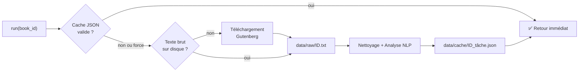

# 📚 BookWorm — Moteur NLP de Book Cards


> **BookWorm** analyse n'importe quel livre du [Project Gutenberg](https://www.gutenberg.org/) et génère automatiquement sa *book card* : métriques lexicales, thèmes, personnages, lieux, résumé et œuvres similaires — **sans aucun LLM**, uniquement avec des techniques NLP classiques (TF-IDF, NER, lemmatisation, similarité cosinus, génération par gabarit).

---

## Sommaire

- [Aperçu](#aperçu)
- [Fonctionnalités](#fonctionnalités)
- [Démonstration](#démonstration)
- [Architecture](#architecture)
- [Installation](#installation)
- [Utilisation](#utilisation)
- [Structure du projet](#structure-du-projet)
- [Système de cache](#système-de-cache)
- [Stack technique](#stack-technique)
- [Tests](#tests)
- [Documentation détaillée](#documentation-détaillée)
- [Auteurs](#auteurs)

---

## Aperçu

BookWorm est un outil en ligne de commande qui prend en entrée un **identifiant de livre Project Gutenberg** (ex. `11` pour *Alice's Adventures in Wonderland*) et produit une analyse littéraire complète. Le projet repose sur un **pipeline modulaire** :

```
Téléchargement → Nettoyage → Analyses NLP → Synthèse → Book Card
```

Chaque étape est un module indépendant, mis en cache sur disque, et réutilisable par les étapes suivantes. L'intégralité de l'analyse est **déterministe et explicable** : aucun modèle génératif n'est utilisé, ce qui rend chaque résultat traçable jusqu'à la règle ou la statistique qui l'a produit.

## Fonctionnalités

| Commande | Module | Description |
|---|---|---|
| `--lexdiv ID` | [`modules/lexdiv.py`](modules/lexdiv.py) | 6 métriques de diversité lexicale (tokens, hapax, TTR…) |
| `--topics ID` | [`modules/topics.py`](modules/topics.py) | Thèmes dominants chapitre par chapitre via TF-IDF + dictionnaire de 147 thèmes littéraires |
| `--entities ID` | [`modules/entities.py`](modules/entities.py) | Personnages et lieux extraits par NER (spaCy) + règles contextuelles |
| `--summarize ID` | [`modules/summary.py`](modules/summary.py) | Résumé en langage naturel généré par gabarit (template NLG) |
| `--similar ID` | [`modules/similarity.py`](modules/similarity.py) | 5 livres les plus proches par similarité cosinus sur vecteurs TF-IDF |
| `--card ID` | [`modules/card.py`](modules/card.py) | **Book card complète** agrégeant toutes les analyses ci-dessus |

## Démonstration

Toutes les sorties ci-dessous sont de **vraies sorties** du programme pour *Alice's Adventures in Wonderland* (`ID 11`).

### Diversité lexicale

```console
$ python3 bookworm.py --lexdiv 11
{
  "tok": 25412,        // nombre total de mots (tokens)
  "typ": 2548,         // nombre de mots uniques (types)
  "hap": 1104,         // mots utilisés une seule fois
  "ttr": 0.1002,       // type-token ratio (richesse du vocabulaire)
  "mwl": 4.13,         // longueur moyenne d'un mot
  "mwf": 9.97          // fréquence moyenne d'un mot
}
```

### Personnages et lieux

```console
$ python3 bookworm.py --entities 11
{
  "characters": ["Alice", "Hatter", "Mouse", "Queen", "Bill", "Majesty", "King", ...],
  "locations":  ["Dinah", "England", "Wonderland"]
}
```

### Résumé généré

```console
$ python3 bookworm.py --summarize 11
Alice's Adventures in Wonderland, by Lewis Carroll, follows Alice, the main
character, alongside figures such as Hatter, Mouse and Queen, in Wonderland
serving as one of the important places in the story. Alice's Adventures in
Wonderland presents a narrative that gradually unfolds around nature, quest,
animal and rescue. Across its 12 chapters, the story moves from nature toward
madness.
```

### Livres similaires

```console
$ python3 bookworm.py --similar 11
[
  "Through the Looking-Glass",
  "Treasure Island",
  "The Secret Garden",
  "The Jungle Book",
  "Peter Pan"
]
```

## Architecture

Le projet suit un pipeline simple : une commande CLI reçoit un identifiant Project Gutenberg, récupère le texte si nécessaire, lance une ou plusieurs analyses, puis sauvegarde le résultat dans le cache JSON.

### Flux général

```text
bookworm.py --<task> ID -> module correspondant -> cache JSON valide ? -> retour cache ou calcul -> sauvegarde dans data/cache/
bookworm.py --<task> ID --force -> ignorer le cache JSON -> recalcul -> sauvegarde dans data/cache/
```

### Acquisition du texte

```text
book_id -> utils/path_config.py -> data/raw/ID.txt existe ? -> lecture du fichier brut
book_id -> utils/path_config.py -> texte absent -> modules/gutenberg.py -> téléchargement Project Gutenberg -> data/raw/ID.txt
texte brut -> modules/cleaner.py -> texte nettoyé -> modules d'analyse
```

Rôle des fichiers :

- `modules/gutenberg.py` télécharge les fichiers `.txt` depuis Project Gutenberg.
- `utils/path_config.py` centralise les chemins et l'accès au texte brut/nettoyé.
- `modules/cleaner.py` retire les marqueurs Gutenberg et la table des matières quand elle est détectable.

### Analyses indépendantes

```text
texte nettoyé -> modules/lexdiv.py -> métriques lexicales -> data/cache/ID_lexdiv.json
texte nettoyé -> modules/topics.py -> lemmatisation spaCy -> TF-IDF par section -> thèmes -> data/cache/ID_topics.json
texte nettoyé -> modules/entities.py -> NER spaCy + règles -> personnages/lieux -> data/cache/ID_entities.json
texte nettoyé + catalogue -> modules/similarity.py -> TF-IDF + similarité cosinus + bonus catégorie -> data/cache/ID_similar.json
```

Rôle de `modules/nlp.py` :

```text
modules/nlp.py -> vectorize() pour TF-IDF -> lexdiv/topics/summary/similarity
modules/nlp.py -> load_spacy() + lemmatize() -> topics/entities
```

### Métadonnées et résumé

```text
texte brut -> utils/metadata.py -> titre + auteur
topics -> utils/metadata.py -> top thèmes -> bookshelves
metadata + entities + topics -> modules/overview.py -> résumé par gabarit
modules/summary.py -> overview.build() -> data/cache/ID_summary.json
```

Le résumé n'utilise pas de modèle génératif : il assemble une phrase de synthèse à partir des résultats déjà calculés.

### Book card complète

```text
bookworm.py --card ID -> modules/card.py
modules/card.py -> utils/metadata.py -> info
modules/card.py -> modules/lexdiv.py -> lexdiv
modules/card.py -> modules/topics.py -> topics
modules/card.py -> modules/entities.py -> entities
modules/card.py -> modules/summary.py -> summary
modules/card.py -> modules/similarity.py -> similar
modules/card.py -> data/cache/ID_card.json
```

`--card` est donc l'agrégateur final : il appelle les autres modules, réutilise leurs caches quand ils existent, puis produit une seule structure JSON complète.

### Logique de cache

```text
run(book_id) -> cache data/cache/ID_task.json existe et valide ? -> retour immédiat
run(book_id) -> cache absent, invalide ou --force -> calcul -> save_json() -> retour résultat
```

Chaque module reste indépendant : il peut être appelé seul depuis la CLI ou indirectement par `--card`.

➡️ L'architecture complète est détaillée dans [`documentation/ARCHITECTURE.md`](documentation/ARCHITECTURE.md), et les choix de conception dans [`documentation/DESIGN_CHOICES.md`](documentation/DESIGN_CHOICES.md).

## Installation

**Prérequis** : Python ≥ 3.12

### Avec [uv](https://docs.astral.sh/uv/) (recommandé)

```bash
git clone <url-du-repo> bookworm && cd bookworm
uv sync
```

### Avec pip

```bash
git clone <url-du-repo> bookworm && cd bookworm
python3 -m venv .venv && source .venv/bin/activate
pip install -r requirements.txt
```

> Le modèle spaCy `en_core_web_sm` est déclaré comme dépendance directe : il s'installe automatiquement, aucun `spacy download` manuel n'est nécessaire.

## Utilisation

```bash
python3 bookworm.py --card 11        # book card complète d'Alice au pays des merveilles
python3 bookworm.py --lexdiv 84      # diversité lexicale de Frankenstein
python3 bookworm.py --topics 1184    # thèmes du Comte de Monte-Cristo
python3 bookworm.py --topics 1184 --force  # recalcule et réécrit le cache JSON
python3 bookworm.py --help           # aide complète
```

Les options sont **mutuellement exclusives** : une commande = une analyse. L'`ID` correspond à l'identifiant du livre sur [gutenberg.org](https://www.gutenberg.org/) (visible dans l'URL de chaque livre).

- **Premier lancement** : le texte est téléchargé puis analysé (l'analyse spaCy peut prendre quelques dizaines de secondes sur un gros livre).
- **Lancements suivants** : la réponse est instantanée grâce au [cache](#système-de-cache).
- **Recalcul volontaire** : ajouter `--force` ignore le JSON existant et réécrit le cache de la commande.

## Structure du projet

```
.
├── bookworm.py              # Point d'entrée CLI (argparse + dispatch dynamique)
├── modules/
│   ├── gutenberg.py         # Téléchargement HTTP depuis Project Gutenberg
│   ├── cleaner.py           # Nettoyage : en-têtes Gutenberg, table des matières
│   ├── nlp.py               # Outils NLP partagés : TF-IDF, spaCy, lemmatisation
│   ├── cache.py             # Lecture/écriture JSON avec validation
│   ├── lexdiv.py            # Métriques de diversité lexicale
│   ├── topics.py            # Extraction de thèmes (TF-IDF par section)
│   ├── entities.py          # NER : personnages et lieux (spaCy + règles)
│   ├── overview.py          # Génération de phrases par gabarit (NLG)
│   ├── summary.py           # Orchestration + cache du résumé
│   ├── similarity.py        # Livres similaires (cosinus + bonus catégorie)
│   └── card.py              # Agrégation : la book card finale
├── utils/
│   ├── path_config.py       # Chemins + accès texte (brut / nettoyé)
│   └── metadata.py          # Extraction titre / auteur depuis l'en-tête
├── data/
│   ├── literary_themes.json # Dictionnaire de 147 thèmes littéraires
│   ├── entity_rules.json    # Règles linguistiques pour la détection de lieux
│   ├── similar_books.json   # Catalogue de 21 livres de référence (3 catégories)
│   ├── raw/                 # Textes bruts téléchargés (cache niveau 1)
│   └── cache/               # Résultats d'analyse JSON (cache niveau 2)
├── documentation/           # Documentation technique détaillée
├── test_gutenberg.py        # Tests du module de téléchargement
├── pyproject.toml           # Dépendances (gérées par uv)
└── requirements.txt         # Dépendances (format pip)
```

## Système de cache

Le cache fonctionne sur **deux niveaux** et rend toute analyse répétée instantanée :



Trois règles gardent le cache simple et contrôlable :

1. **Validation de schéma** — chaque module vérifie la structure du JSON (clés requises, types) avant de le servir ;
2. **Recalcul explicite** — `--force` ignore le cache existant et force la régénération du résultat ;
3. **Écriture atomique par tâche** — un fichier par couple `(livre, tâche)` : `11_topics.json`, `11_entities.json`…

## Stack technique

| Outil | Rôle | Pourquoi ce choix |
|---|---|---|
| **spaCy** (`en_core_web_sm`) | NER, lemmatisation, POS-tagging | Pipeline industriel, rapide, modèle léger suffisant pour de la littérature anglaise |
| **scikit-learn** | `TfidfVectorizer`, `cosine_similarity` | Implémentations de référence, vecteurs creux efficaces sur des livres entiers |
| **requests** | Téléchargement HTTP | Simplicité, gestion d'erreurs propre |
| **asyncio** | Téléchargements concurrents (`--similar`) | 21 livres téléchargés 4 par 4 au lieu de séquentiellement |
| **argparse** | Interface CLI | Bibliothèque standard, zéro dépendance |
| **uv** | Gestion des dépendances | Lockfile reproductible, installation du modèle spaCy déclarative |

## Tests

```bash
.venv/bin/python3 test_gutenberg.py
```

Vérifie le téléchargement (livre existant, second miroir, livre inexistant → erreur propre).

## Documentation détaillée

| Document | Contenu |
|---|---|
| [`documentation/ARCHITECTURE.md`](documentation/ARCHITECTURE.md) | Pipeline complet, diagrammes de séquence, système de cache |
| [`documentation/DESIGN_CHOICES.md`](documentation/DESIGN_CHOICES.md) | Choix de conception, alternatives testées, compromis techniques |
| [`documentation/MODULES.md`](documentation/MODULES.md) | Référence module par module : rôle, API, algorithme, exemples |

## Auteurs

Projet réalisé dans le cadre du cursus **Epitech**.

- **Driss Costa** — [@Driss2003costa](https://github.com/Driss2003costa)
- **Dimitri Sorokine** — [@SorokineDimitri](https://github.com/SorokineDimitri)
