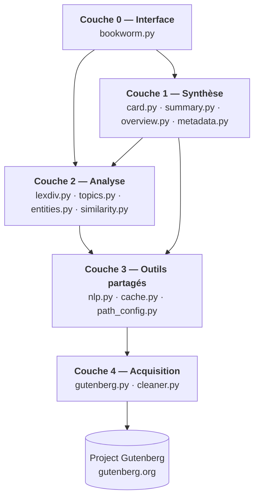
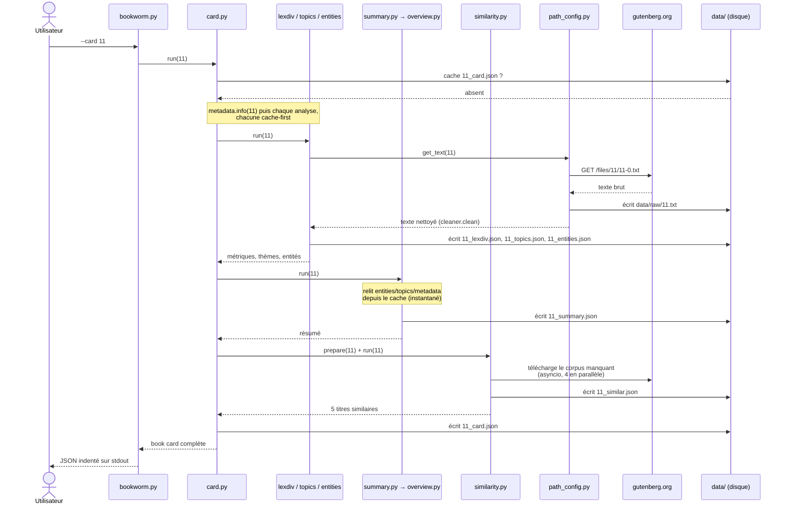
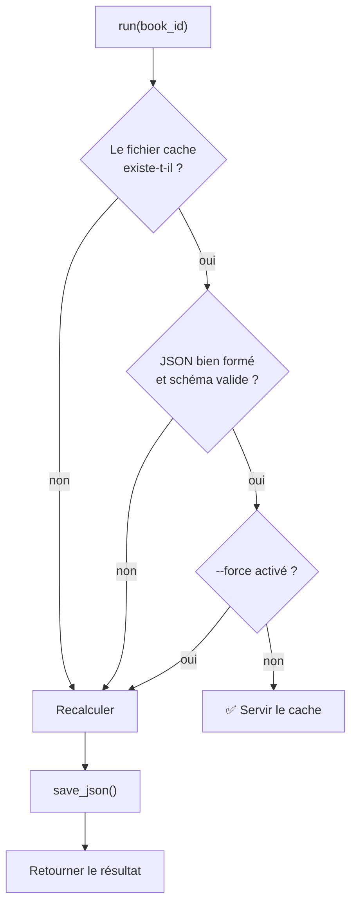
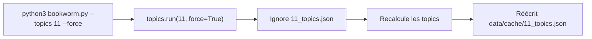

# Architecture de BookWorm

Ce document décrit l'architecture complète du projet : le pipeline de traitement, la communication entre les fichiers et le système de cache. Pour la référence détaillée de chaque module (API, algorithmes), voir [`MODULES.md`](MODULES.md). Pour les arbitrages techniques, voir [`DESIGN_CHOICES.md`](DESIGN_CHOICES.md).

## Sommaire

- [1. Vue d'ensemble](#1-vue-densemble)
- [2. Principes de conception](#2-principes-de-conception)
- [3. Le pipeline de bout en bout](#3-le-pipeline-de-bout-en-bout)
- [4. Communication entre les fichiers](#4-communication-entre-les-fichiers)
- [5. Déroulé complet d'un `--card`](#5-déroulé-complet-dun---card)
- [6. Le système de cache](#6-le-système-de-cache)
- [7. Les fichiers de données](#7-les-fichiers-de-données)
- [8. Choix de conception et compromis](#8-choix-de-conception-et-compromis)

---

## 1. Vue d'ensemble

BookWorm est structuré comme un **pipeline en couches**. Chaque couche ne connaît que la couche en dessous d'elle :

| Couche | Responsabilité | Fichiers |
|---|---|---|
| **Interface** | Parser les arguments, dispatcher vers le bon module, formater la sortie | `bookworm.py` |
| **Synthèse** | Combiner les analyses en livrables lisibles (résumé, book card) | `card.py`, `summary.py`, `overview.py`, `utils/metadata.py` |
| **Analyse** | Une analyse NLP = un module, indépendant des autres | `lexdiv.py`, `topics.py`, `entities.py`, `similarity.py` |
| **Outils partagés** | Code mutualisé : vectorisation, spaCy, cache JSON, chemins | `nlp.py`, `cache.py`, `utils/path_config.py` |
| **Acquisition** | Obtenir un texte propre à partir d'un simple ID | `gutenberg.py`, `cleaner.py` |

## 2. Principes de conception

Quatre principes structurent tout le code :

1. **Une interface unique : `run(book_id)`.** Chaque module d'analyse expose une fonction `run(book_id)` qui retourne un résultat sérialisable en JSON. Le CLI dispatche dynamiquement vers le bon module (`bookworm.py:53-64`) sans connaître son implémentation. Ajouter une nouvelle analyse = créer un module avec un `run()` et l'enregistrer dans `TASK_MODULES`.

2. **Cache-first.** Chaque `run()` commence par tenter de servir le cache. Le calcul est l'exception, pas la règle. Voir [section 6](#6-le-système-de-cache).

3. **Composition plutôt que duplication.** Les modules de synthèse ne recalculent rien : `overview.py` appelle `entities.run()`, `topics.run()` et `metadata.info()` ; `card.py` appelle les 6 analyses. Comme chacune est cachée, l'agrégation est quasi gratuite.

4. **Zéro IA générative.** Le résumé est produit par **gabarit** (phrases à trous remplies avec les résultats d'analyse). Les thèmes viennent d'un **dictionnaire littéraire** croisé avec des poids TF-IDF. Tout résultat est traçable jusqu'à la statistique ou la règle qui l'a produit — ce qui rend le système explicable, déterministe et léger (aucun GPU, aucun appel API).

## 3. Le pipeline de bout en bout

Tout livre suit le même chemin, quelle que soit l'analyse demandée :

**Étape 1 — Acquisition** (`modules/gutenberg.py`). Le texte est téléchargé en essayant deux formats d'URL de Gutenberg (les livres ne sont pas tous hébergés au même endroit). Le texte brut est écrit dans `data/raw/<id>.txt` et ne sera plus jamais retéléchargé.

**Étape 2 — Nettoyage** (`modules/cleaner.py`). Les fichiers Gutenberg contiennent un en-tête légal, parfois des crédits d'illustration et une table des matières. Le nettoyeur :
- coupe tout ce qui précède `*** START OF ...` et suit `*** END OF ...` ;
- détecte les titres de chapitre (`CHAPTER I`, `LETTER 1`, `PART IV`…) et saute à la **deuxième occurrence** du premier titre — la première occurrence étant l'entrée de la table des matières, la deuxième le vrai début du récit.

**Étape 3 — Analyse**. Quatre analyses indépendantes, chacune dans son module (détails dans [`MODULES.md`](MODULES.md)) :

| Analyse | Technique principale |
|---|---|
| `lexdiv` | Tokenisation scikit-learn + comptages (`Counter`) |
| `topics` | Découpage en chapitres → lemmatisation spaCy → TF-IDF par section → mapping sur un dictionnaire de 147 thèmes |
| `entities` | NER spaCy + apprentissage de règles propres au livre + scoring contextuel |
| `similar` | TF-IDF sur un corpus de 21 livres + similarité cosinus + bonus de catégorie |

**Étape 4 — Synthèse**. `overview.py` assemble des phrases à partir des métadonnées, entités et thèmes ; `summary.py` y ajoute le cache ; `card.py` agrège les six résultats en un seul JSON.

## 4. Communication entre les fichiers

- **`bookworm.py` ne fait aucun `import` en dur des modules d'analyse** : il utilise `__import__("modules." + nom)` à partir de la table `TASK_MODULES`. Le CLI reste donc à 70 lignes et n'a pas besoin d'être modifié quand un module évolue.
- **`nlp.py` est la seule porte d'entrée vers spaCy et TF-IDF.** Le modèle spaCy est chargé une seule fois par configuration grâce à `functools.lru_cache` — un chargement coûte ~1 s, le partager entre modules est essentiel.
- **`utils/path_config.py` est le point de convergence de l'acquisition** : `get_raw_text()` (télécharge si absent, sinon lit le disque) et `get_text()` (pareil + nettoyage). Aucun module d'analyse ne parle directement à `gutenberg.py`, sauf `similarity.py` qui a besoin de téléchargements concurrents.
- **Dépendance croisée contrôlée** : `metadata.py` (couche synthèse) appelle `topics.run()` pour remplir le champ `bookshelves` à partir des thèmes détectés. C'est la seule remontée de ce type, et elle reste sans cycle.

## 5. Déroulé complet d'un `--card`

Le diagramme de séquence ci-dessous montre tous les échanges pour `python3 bookworm.py --card 11` **sur un cache froid** (premier lancement) :

Au **second lancement**, la séquence se réduit à : `card.run(11)` → lecture de `11_card.json` → validation → retour. Aucun téléchargement, aucun calcul spaCy.

## 6. Le système de cache

### Deux niveaux

| Niveau | Emplacement | Contenu | Évite |
|---|---|---|---|
| 1 — Texte brut | `data/raw/<id>.txt` | Le fichier Gutenberg tel quel | Le réseau |
| 2 — Résultats | `data/cache/<id>_<tâche>.json` | Le résultat d'une analyse | Le calcul NLP |

### Cycle de décision

Chaque `run()` suit exactement la même logique :

### Les trois règles

1. **Validation de schéma** — `cache.load_json()` rejette tout JSON mal formé ; chaque module ajoute sa propre validation structurelle (`valid_cached_topics`, `valid_cached_entities`, `valid_cached_card`…). Un cache écrit par une ancienne version du code, ou corrompu, est silencieusement recalculé.

2. **Recalcul explicite par `--force`** — modifier le code ou un fichier de données ne déclenche plus automatiquement une invalidation par date. Si l'on veut recalculer un résultat, on lance la commande avec `--force`.

3. **Granularité par tâche** — un fichier par couple (livre, analyse). Invalider les topics ne touche pas aux entités déjà calculées.

### Régénération contrôlée

Pour `--card --force`, le flag est propagé aux sous-modules (`lexdiv`, `topics`, `entities`, `summary`, `similar`) afin de reconstruire toute la card à partir de résultats frais.

## 7. Les fichiers de données

Le comportement linguistique du moteur est **externalisé dans trois fichiers JSON** — on peut affiner les résultats sans toucher au code Python :

| Fichier | Taille | Rôle | Consommé par |
|---|---|---|---|
| `data/literary_themes.json` | 147 thèmes | Dictionnaire `thème → mots-clés` (ex. `"adventure": ["quest", "journey", ...]`). Sert à nommer les topics TF-IDF. | `topics.py` |
| `data/entity_rules.json` | 3 listes (320 entrées) | Règles linguistiques pour la détection de lieux : prépositions locatives (`in`, `at`, `near`…), noms génériques de lieux (`castle`, `garden`…), faux positifs à exclure (`voice`, `heart`…). | `entities.py` |
| `data/similar_books.json` | 21 livres | Corpus de référence pour `--similar` : id Gutenberg, titre, catégorie (3 catégories : jeunesse, policier, SF/fantasy). | `similarity.py` |

Tous trois sont chargés une seule fois par processus via `functools.lru_cache`. Après modification d'un de ces fichiers, il faut relancer la commande avec `--force` pour régénérer le cache correspondant.

## 8. Choix de conception et compromis

Les arbitrages techniques ont été extraits dans un document dédié : [`DESIGN_CHOICES.md`](DESIGN_CHOICES.md).
